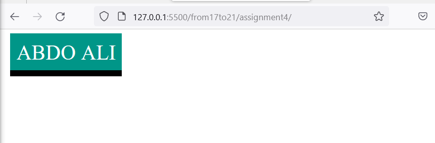

# all assignments

- assignment one
 decorate the text using text shadow 

- assignment two
  here we use text transformation

- assignment four
  decorate a button with text align and border and text transoforer

