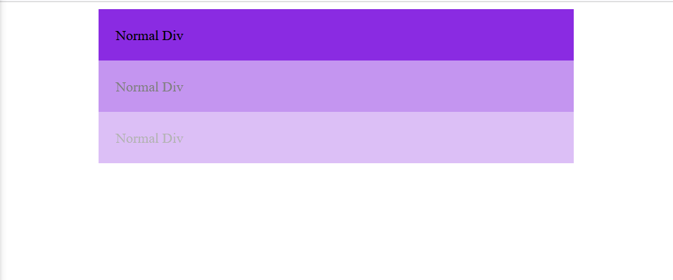
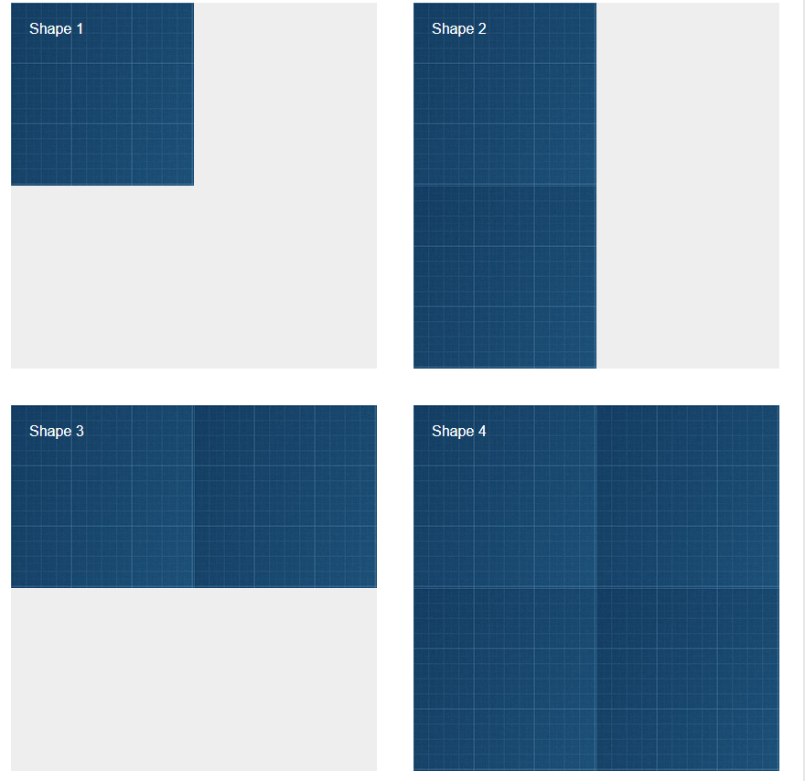
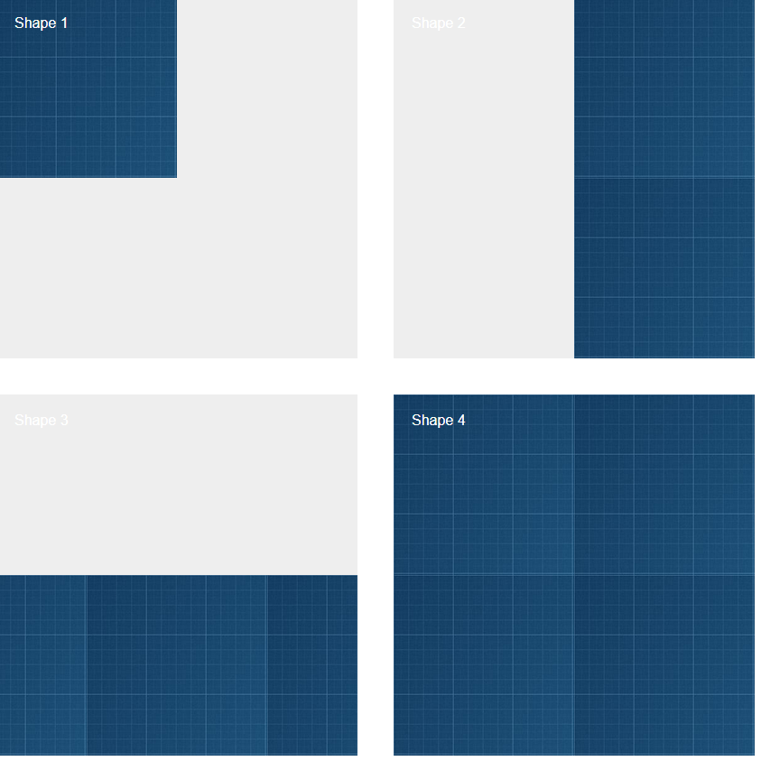

# all assignments

- assignment one
  make a back ground for all divs and change the make padding and center the divs by using margin :auto , and chnage the opacity for the background

- assignment two
  make a background image and repeat it in x and y and all and didn't repeat it in the first shap
  

- assignment three
  make a background image and repeat it in x and y and all and adding background position
  

